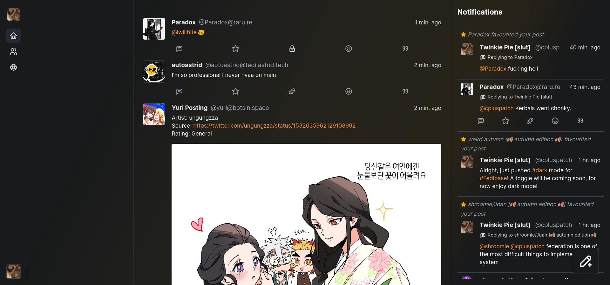
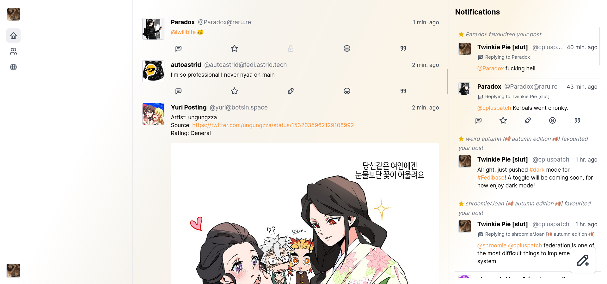

# Fedibase

### A beautiful, simple client for the Fediverse.

```
⚠️ Fedibase is in public beta, and is missing many features
⚠️ No promises will be made on ETA for missing features
```




## Technologies used

- [Next.js](https://nextjs.org/) for the web app
- [TailwindCSS](https://tailwindcss.com) for styling
- [Megalodon](https://github.com/h3poteto/megalodon) for the Fediverse API
- [PNPM](https://pnpm.io/) for package distribution

## Features

- Fully mobile-compatible and responsive
- Compatible with Mastodon, Pleroma and Misskey
- Dark/light mode support (toggle coming soon)
- Beautiful animations
- Simple and clean interface
- Self-hostable (anyone can host it)
- Clientside only (stores all data in browser)

### Planned features (coming soon™️):
- Quote posting
- Emoji reactions
- More timelines
- Placing CWs on posts
- File upload UI rework
- Drag and drop or paste files to upload

## Collaborators

- [Daikei](https://codeberg.org/daikei/) helped me fix a couple of annoying bugs!

---
Licensed under GPLv3